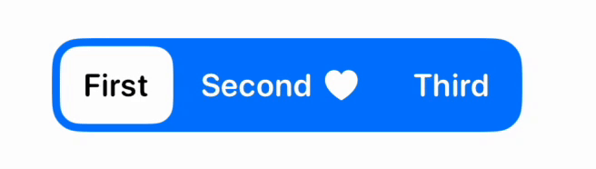

# iOS

## Команда

Разработкой приложения занимается более 25 iOS-разработчиков.

Продуктовые разработчики из разных команд пилят новые фичи и рефакторят существующие, а команда iOS Platform разрабатывает и поддерживает базовые фреймворки и делает разработку фичей удобнее и быстрее.

Вопросы CI/CD берут на себя наши мобильные девопсы.

## Проект

Весь iOS живёт в едином проекте с модульной архитектурой. Мы релизим приложение раз в неделю. Поддерживаем 3 последних версии операционки и как можно быстрее адоптим последнюю версию Xcode.

Синхронизацию на проекте мы поддерживаем регулярными встречами. Все iOS разработчики раз в неделю собираются на TechDemo, чтобы обсудить текущие задачи и боли. Мы также проводим iOS митапы и разгоняем там последние новости индустрии, прогоняем доклады перед конференциями и болтаем за жизнь.

## Стек

- Swift + несколько процентов Obj-C в коде, который трогать не требуется
- Для многопоточности — Swift Concurrency – во многих модулях уже включены Complete-проверки и мигрируем оставшиеся
- Модульная архитектура приложения на Cocoapods с разделением модулей по типам и автоматическами проверками правильности построения связей между модулями
- Архитектура вью-слоя – The Composable Architecture (TCA). Старые модули имеют реализацию MVVM с немутабельным стейтом и поддержкой как UIKit, так и SwiftUI.
- Зависимости мы используем на основе Swift Dependencies от Pointfree. В других местах еще встречается предыдущий подход к DI – своеобразный service locator на структурах с удобной организацией моков для тестов и превью.
- UI разрабатываем на SwiftUI, старые интерфейсы написаны на UIKit
- У нас есть своя дизайн-система с основными компонентами приложения

## Тесты

Мы пишем Unit и UI-автотесты.

В нашем проекте более 2300 Unit-тестов, это как тесты на бизнес-логику, так и снепшот тесты вью.

UI-тесты пишутся на основной продуктовый флоу, сейчас их более 150 и стремимся к полному покрытию ключевых сценариев.

Их пишут и поддерживают продуктовые разработчики, а команда платформы предоставляет для этого удобный тулинг.

## Проверки кода

У нас множество проверок кода, как локально, так и на CI, которые обеспечивают единство написания кода и снижают уровень ошибок.

Мы проверяем стиль кода, ресурсы приложения, локализации, использования deprecated-кода и многое другое.

В проекте установлена zero-warnings policy, соответственно ни один ворнинг не пройдет в мастер.

В пулл-реквестах обязателен тех-дизайн вносимых изменений. Ревьюеры назначаются автоматически в зависимости от нагрузки и отпусков.

Собственная система импакт-анализа запускает UI тесты только на изменения, которые могли повлиять на поведение теста.

Среднее время проверки пулл-реквеста на CI 12-15 минут, что обеспечивает достаточно быстрый фидбек при разработке.

## Мы в публичном пространстве

### 📹 Видео

#### [Сергей Новиков, «Упрощаем релиз мультиязычного приложения», Kolesa Conf 2022](https://www.youtube.com/watch?v=qbsWN6vvHrM)

#### [Дмитрий Бакланов. SwiftUI. как это работает](https://www.youtube.com/watch?v=gKPhXDpYGzE)

#### [Алексей Агапов. Functional Core Imperative Shell подход](https://www.youtube.com/watch?v=JaXgIibNWSo)

---

### 🎙️ Подкасты

#### [Coffee&Code | Live #3 Аааавиасейлс, в сторону от iOS, поиск информации, приглашенный гость - Алексей Агапов](https://coffeecodepodcast.mave.digital/ep-20)

### 📄 Статьи

#### [Артем Загоскин. Как я разрабатывал кастомный Segmented Control на SwiftUI](https://tyomazago.medium.com/customizable-segmented-control-in-swiftui-44aba026eab8)

- [🇷🇺 ru версия](https://habr.com/en/articles/732640/)
- [🏴󠁧󠁢󠁥󠁮󠁧󠁿 en версия](https://tyomazago.medium.com/customizable-segmented-control-in-swiftui-44aba026eab8)

#### [Агапов Алексей. Control dependencies with structs in Swift](https://dev.to/agapovone/control-dependencies-with-structs-in-swift-379g)